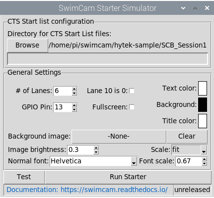

.. include:: common.rst
=========
Simulator
=========

A starter simulator along with sample start lists is included in the package.

Launch the simulator as follows

  cd simulator
  python3 simulator.py

The simulator will connect to the [sc] core and display configuration options

   Configuration screen

When the program is first started, it will connect to the core and then
present the user with the configuration screen. This screen has options 
for the location of the startlists and basic customization.

This page walks through the configuration screen from top to bottom and
explains the options.

|clearfloat|

Start list configuration
========================

The first step in configuring |sc| is to obtain the start list files.

Creating start list files
-------------------------

The start lists used by |sc| are the same as the files that are used for
scoreboards run by a Colorado System 6 or similar system. In Hy-Tek Meet 
Manager, they can be created by selecting:

    File > Export > Start Lists for Scoreboard > Start Lists for CTS |br|
    `(Click here for an example) <_static/media/mm_startlist_export.png>`_

The above command will create a series of files named ``E<###>.scb``, one for
each event in the session(s) that were exported. The start lists should all be
placed into a directory that |sc| will be able to access.

.. _set_start_list_dir:

Selecting the start list directory
----------------------------------

.. image:: media/config_startlist.png
   :scale: 75 %
   :align: right

The top section of the configuration screen is used to select the directory
where the start lists have been saved. Click the "Browse" button and
navigate to the appropriate directory. Once chosen, the directory path will
appear on the right.

|clearfloat|

General options
===============

.. image:: media/config_general.png
   :scale: 75 %
   :align: right

The final section of the configuration screen is used to set the general
options that control the look of the scoreboard. When customizing options,
click the "Test" button to display a sample scoreboard in the chosen style.

Below is an explanation of each option. Tooltips are also available in the
application by hovering over any item.

Lane count
    Sets the number of lanes to display on the simulator.
Fullscreen
    Selecting this option runs the simulator in fullscreen (non-windowed)
    mode. Leaving it de-selected will display the scoreboard in a normal
    window that can be moved, resized, maximized, etc.
Text, background, and title colors
    Clicking on the corresponding color swatch allows customizing the color
    for each of these items.
Background image
    An image can be selected to display behind the startlist. The currently
    selected image is shown on the button. The selection can be cleared by
    pressing the "Clear" button.

    When selecting a background image, keep in mind that any transparent areas
    of the image will be replaced by the solid background color (above
    option).
Image brightness
    This allows decreasing the brightness of the background image so that the
    scoreboard results are easier to read.
Scale
    This adjusts how the background image is scaled to fit on the startlist.
    There are four options:

    - None: The image is not scaled; it is used as-is.
    - Cover: The image is uniformly scaled so that the **smallest** dimension
      fills the screen (i.e., the image will fully "cover" the screen).
    - Fit: The image is uniformly scaled so that the **largest** dimension
      fills the screen (i.e., the image will "fit" within the screen).
    - Stretch: The image is non-uniformly scaled so that the image fully fills
      the screen yet still fits within it.
Normal font 
    These select the font that will be used for displaying the text on the
    scoreboard. Any font that is installed on the computer may be used.

Font scale
    The size of the fonts are automatically chosen based on the size of the
    scoreboard window and the number of lanes. This scale parameter controls
    the amount of "whitespace" that is left between scoreboard lines. Choosing
    a larger scale factor will produce larger text, but it can also lead to
    the scoreboard text looking "crowded."

**Once the simulator is configured, click the "Run Simulator" button to
begin!**
